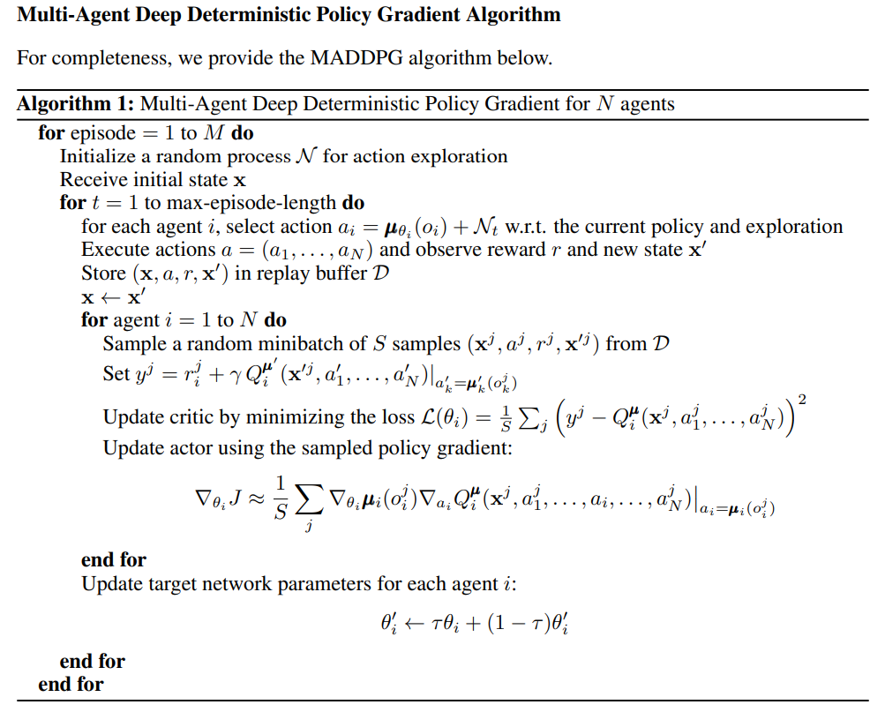

## PROJECT-3 Collaboration and Competition
### 1- Pseudocode of the Employed Algorithm; MADDPG

For detailed information about the algorithm see this paper: https://arxiv.org/pdf/1706.02275.pdf

	

 

### 2- Actor-Critic Networks and Tuned Hyperparameters
Actor Network:
- Number of nodes in first hidden layer: 64
- Number of nodes in Second hidden layer: 32
- Input: states
- Output: actions
- Activation functions: Relu - Relu - tanh   

Critic Network:
- Number of nodes in first hidden layer: 256
- Number of nodes in Second hidden layer: 128
- Number of nodes in third hidden layer: 32
- Input: states+actions
- Output: score
- Activation functions: Relu - Relu - Relu - None   

Hyperparameters:
- buffer_size = 1e6
- batch_size = 1024
- gamma: .99
- tau: 1e-3
- lr_critic: 1e-4
- lr_actor: 1e-r
- max_t: 10000
- n_episodes: 3000

### 3- Results:
I trained the agent with two different senarios. First, using shared actor-critic, and then tested with separate actor-critic and bufferes. 

Score of first trial:

	

 

Score of second trial:

	

 

Here is also a video showing performance of agent in environment v1:

	

 

### 4- Future works to improve the agent:
- Testing performance of PPO algorithm
- Further turing hyperparameters and actor/critic networks
- Using prioritized replay buffer

